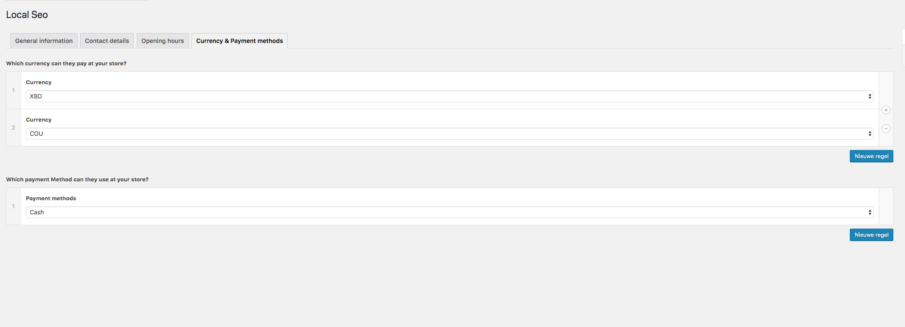

# Local-SEO
The local SEO plug-in 

OffbeatWP has an SEO plugin for the local business that allows you to add a ld+json string (structured data). 
Using this plug-in you can notify Google (and other search engines) that you have a local company. So the information you add to the website may appear in Google.

Below a list of the data, you can add to your website:

- A Type (what kind of company you have).
- The company phone number.
- The company fax number.
- The price range of the products the company is selling ($  <=> $$$).
- The company name.
- The company address.
- The company opening time.
- The currency the company uses.


- To add the package to your offbeatWP theme add it to your package.json in the offbeatWP theme.

```bash
composer require offbeatwp/local-seo
```

Next, add the following line to your `config/services.php` file:

```
OffbeatWP\LocalSeo\Service::class,
```

### Screenshot


